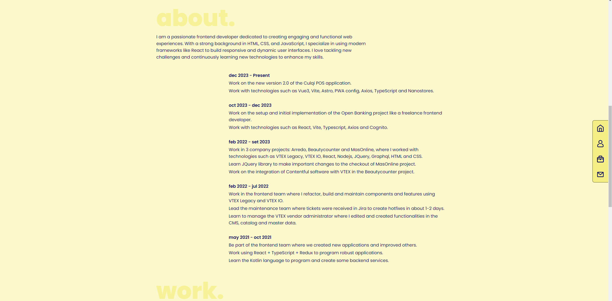
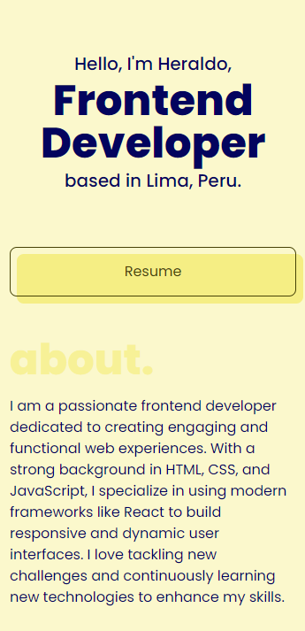

# Heraldo Fortuna Portfolio



> Screenshot - Desktop



> Screenshot - Mobile

---

## Table of Contents

-   [Description](#description)
-   [How to use?](#how-to-use)
-   [References](#references)
-   [License](#license)
-   [Author](#author)

---

## Description

- Web portfolio of frontend developer Heraldo Fortuna.

### Technologies

-   Astrojs
-   TypeScript
-   Tailwind

[Go up](#heraldo-fortuna-portfolio)

---

## How to use?

### Installation:

Enter and run the following sentence in your console:

```html
npm install
```

### Run the project:

Enter and run the following sentence in your console:

```html
npm start
```

to enter developer mode.

Finally, open [http://localhost:4321](http://localhost:4321) to see it in your default browser.

---

## Comments

- For a long time I wanted to make a portfolio using some javascript framework to be able to make it maintainable over time. I chose astro because it is the best option for static websites. The development experience has been fun but the deploy not so much.

[Go up](#heraldo-fortuna-portfolio)

---

## License

MIT License

Copyright (c) [2024] [Heraldo Fortuna]

Permission is hereby granted, free of charge, to any person obtaining a copy
of this software and associated documentation files (the "Software"), to deal
in the Software without restriction, including without limitation the rights
to use, copy, modify, merge, publish, distribute, sublicense, and/or sell
copies of the Software, and to permit persons to whom the Software is
furnished to do so, subject to the following conditions:

The above copyright notice and this permission notice shall be included in all
copies or substantial portions of the Software.

THE SOFTWARE IS PROVIDED "AS IS", WITHOUT WARRANTY OF ANY KIND, EXPRESS OR
IMPLIED, INCLUDING BUT NOT LIMITED TO THE WARRANTIES OF MERCHANTABILITY,
FITNESS FOR A PARTICULAR PURPOSE AND NONINFRINGEMENT. IN NO EVENT SHALL THE
AUTHORS OR COPYRIGHT HOLDERS BE LIABLE FOR ANY CLAIM, DAMAGES OR OTHER
LIABILITY, WHETHER IN AN ACTION OF CONTRACT, TORT OR OTHERWISE, ARISING FROM,
OUT OF OR IN CONNECTION WITH THE SOFTWARE OR THE USE OR OTHER DEALINGS IN THE
SOFTWARE.

[Go up](#heraldo-fortuna-portfolio)

---

## Author

-   Twitter - [@heraldofortuna](https://twitter.com/heraldofortuna)
-   GitHub - [heraldofortuna](https://github.com/heraldofortuna)
-   Linkedin - [heraldofortuna](https://www.linkedin.com/in/heraldo-fortuna/)

[Go up](#heraldo-fortuna-portfolio)